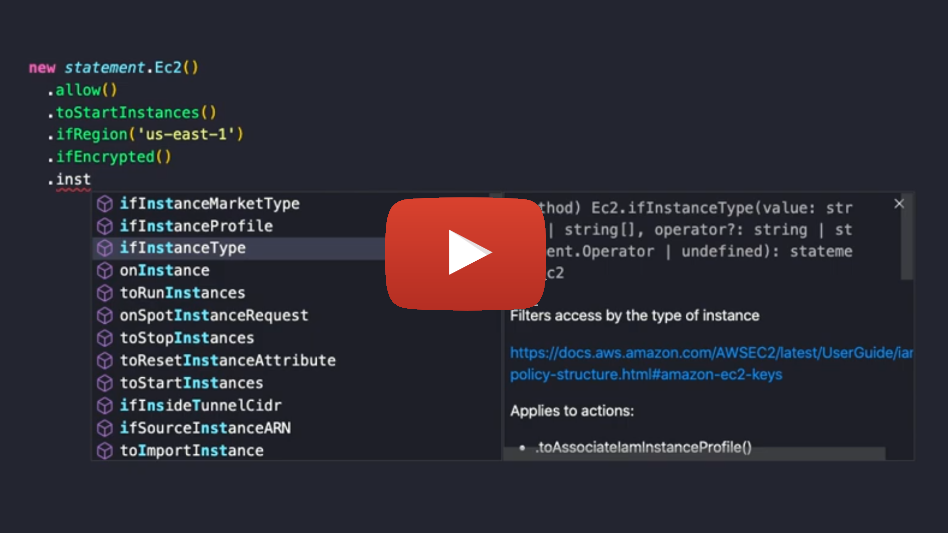

.. meta::
   :description: AWS IAM policy statement generator with fluent interface
   :keywords: aws, iam, policy, statement, generator, cdk, aws-cdk, iam-floyd, floyd

.. toctree::
   :maxdepth: 3
   :hidden:

   packages
   getting-started
   vocabulary
   examples
   collections
   faq
   legal

IAM Floyd
=========

.. include:: _warning.rst
.. include:: _links.rst

AWS IAM policy statement generator with fluent interface.

..
   stats

Support for:

- 239 Services
- 7955 Actions
- 781 Resource Types
- 466 Conditions

..
   /stats

Similar projects
----------------

* `cdk-iam-actions <https://github.com/spacerat/cdk-iam-actions>`_
* `cdk-iam-generator <https://github.com/srihariph/cdk-iam-generator>`_
* `iam-policy-generator <https://github.com/aletheia/iam-policy-generator>`_
* `policyuniverse <https://github.com/Netflix-Skunkworks/policyuniverse>`_
* `policy_sentry <https://github.com/salesforce/policy_sentry>`_
